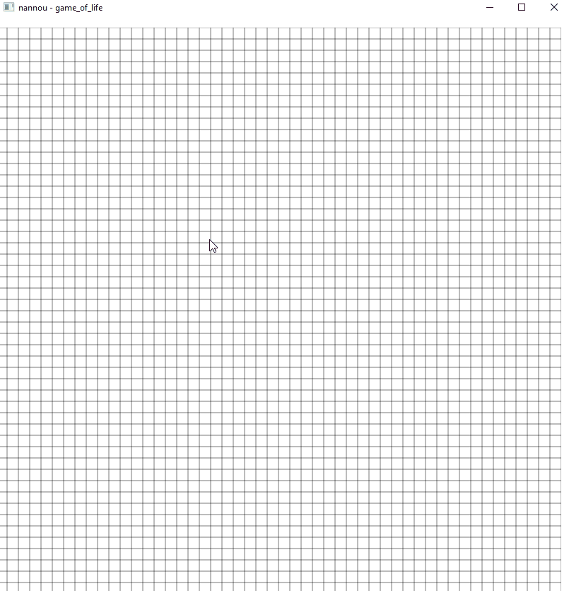
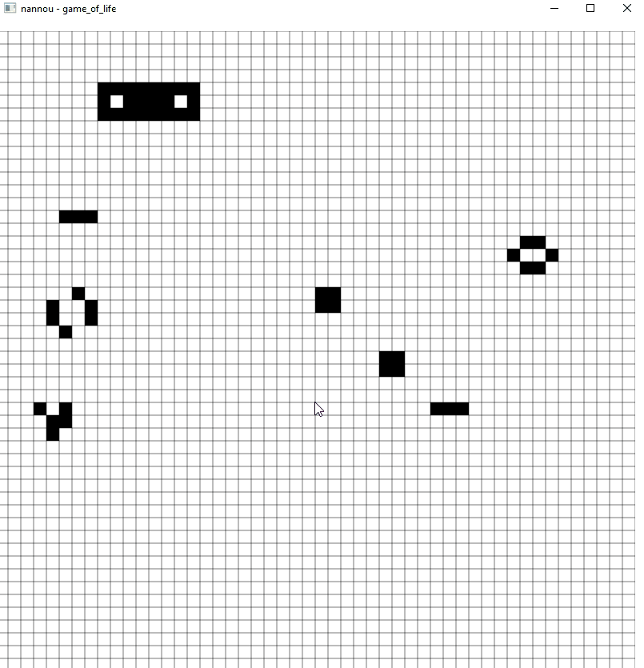

### GAME OF LIFE IMPLEMENTATION IN RUST

Implementation of game of life using nannou rust library, for learning purposes (first rust project). 

## Usage

```
cargo run --release
```

when in edit mode (default) press left mouse button to add new living cells, to remove them press right mouse button.



To switch between modes (edit/update) press space bar.

